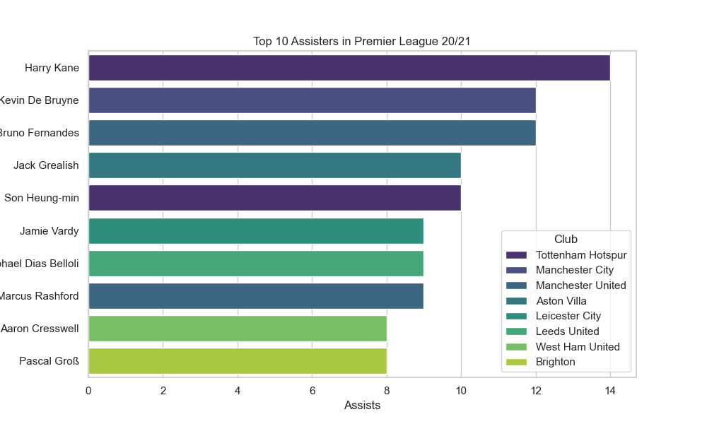

# Overview

As a software engineer passionate about leveraging data to uncover insights and trends, I embarked on a project to analyze performance data from the English Premier League (EPL) for the 2020-2021 season. This endeavor aims to apply data science techniques to understand patterns and performances within professional football, furthering my knowledge and skills in data analysis and software development.

The data sets used in this analysis include detailed match results and player statistics. These data sets provide comprehensive insights into individual player performances, including goals scored, assists, passes attempted, and pass completion rates, as well as match outcomes such as home and away team scores, match dates, and full-time results.

-   [Results Dataset](https://www.kaggle.com/datasets/irkaal/english-premier-league-results)
-   [Players Dataset](https://www.kaggle.com/datasets/rajatrc1705/english-premier-league202021)

The primary purpose of developing this software is to conduct a thorough analysis of the season data to extract meaningful insights about player performances and team strategies. By doing so, I aim to:

-   Identify the top performers of the season based on various metrics such as goals scored, and assists.
-   Analyze team performances to determine the impact of playing at home versus away on match outcomes.
-   Look for a relationship between goals scored and assists provided by the same player.

Explore the relationships between different statistical measures and their contribution to a team's success or an individual's performance.
This project is a practical application of data analysis and software engineering principles, enabling me to deepen my understanding of football analytics and the technical aspects of data processing and visualization. Through this analysis, I aspire to contribute to the broader community of football enthusiasts and data scientists by sharing insights and methodologies that can enhance our understanding of the beautiful game.

[Software Demo Video](https://youtu.be/PbGkYJz-d4o)

# Data Analysis Results

## Question 1: What are the top scorers and assisters in the Premier League 20/21?

### The top scorers were:

1. Harry Kane (Tottenham Hotspur) - 23 goals
2. Mohamed Salah (Liverpool FC) - 22 goals
3. Bruno Fernandes (Manchester United) - 18 goals
4. Patrick Bamford (Leeds United) - 17 goals
5. Son Heung-min (Tottenham Hotspur) - 17 goals
6. Dominic Calvert-Lewin (Everton) - 16 goals
7. Jamie Vardy (Leicester City) - 15 goals
8. Ollie Watkins (Aston Villa) - 14 goals
9. İlkay Gündoğan (Manchester City) - 13 goals
10. Alexandre Lacazette (Arsenal) - 13 goals

### The top assist providers were:

1. Harry Kane (Tottenham Hotspur) - 14 assists
2. Kevin De Bruyne (Manchester City) - 12 assists
3. Bruno Fernandes (Manchester United) - 12 assists
4. Jack Grealish (Aston Villa) - 10 assists
5. Son Heung-min (Tottenham Hotspur) - 10 assists
6. Jamie Vardy (Leicester City) - 9 assists
7. Raphael Dias Belloli (Leeds United) - 9 assists
8. Marcus Rashford (Manchester United) - 9 assists
9. Aaron Cresswell (West Ham United) - 8 assists
10. Pascal Groß (Brighton) - 8 assists

## Question 2: What is the location impact on the match results?

Based on the analysis of the season data:

The home win rate is approximately 37.89%.
The away win rate is slightly higher at approximately 40.26%.
This indicates that during the season, teams had a slightly higher success rate when playing away from home than at home.
This could indicate several factors, such as the lack of spectators due to pandemic restrictions possibly reducing the traditional home advantage.
This analysis offers a fascinating insight into how location impacts game outcomes, suggesting that playing away did not have the negative impact often expected in football matches in this particular season.

## Question 3: What is the relationship between goals scored and assists provided by players?

While some players excel in scoring and providing assists, the overall relationship between these two metrics is not strongly linear. This reflects the diversity in player roles and strategies within football, where individual strengths and team tactics influence a player's contributions in terms of goals and assists.

# Development Environment

Python 3.12.1  
Visual Studio Code  
Git & GitHub  
Pandas
Matplotlib
Seaborn

# Useful Websites

-   [Introduction to Pandas](https://pandas.pydata.org/docs/getting_started/index.html)
-   [10 minutes to Pandas](https://pandas.pydata.org/docs/user_guide/10min.html#min)
-   [Quick start guide with Matplotlib](https://matplotlib.org/stable/users/explain/quick_start.html)
-   [Getting started with Seaborn](https://seaborn.pydata.org/installing.html#installing-and-getting-started)

# Future Work

-   Predictive Modeling for Match Outcomes of Player Performances
-   Interactive Dashboard for Real-time Analysis
-   An In-depth Tactical Analysis
